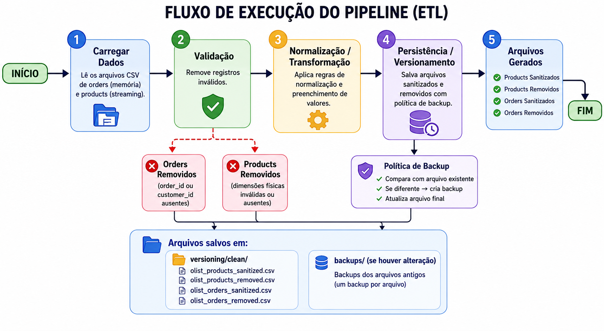

# Projeto: Processamento e Limpeza do Dataset Olist

Visualização do fluxo do pipeline:



Este repositório contém um pipeline simples de ETL (Extract, Transform, Load) para
limpeza, normalização e versionamento de arquivos CSV do dataset `olist`.

Sumário
- Visão geral
- Arquitetura e responsabilidades dos módulos
- Estrutura de pastas
- Fluxo de execução (ETL)
- Regras de negócio e validações
- Descrição detalhada dos módulos e funções principais
- Configurações
- Como executar
- Reflexão: 

---------
O objetivo do projeto é ler arquivos CSV de produtos e pedidos, validar os
registros, aplicar regras de normalização (formatar campos, preencher valores
faltantes) e gravar os resultados em um diretório de versionamento (`versioning/clean`),
com política de backups.

O pipeline principal está em `main.py` e segue as etapas:
1. Carregar arquivos (`infrastructure.initial_data_loader`)  
2. Validar e remover registros inválidos (`service.validation.*`)  
3. Normalizar/transformar os registros (`service.*_service_impl`)  
4. Salvar resultados com versão/backup (`infrastructure.storage` + `infrastructure.output`)

Arquitetura e responsabilidades
-------------------------------
O projeto está organizado em camadas/coisas com responsabilidades claras:

- infrastructure
  - `initial_data_loader.py`: Leitura dos CSVs (orders carregado em memória, products em streaming).
  - `output.py`: Funções utilitárias para escrever CSVs com estratégia de backup atômico.
  - `storage.py`: Abstração de gravação: `CleanStorage` e `ResultSaver` para salvar arquivos sanitizados e removidos.
  - `config.py`: Diretórios e políticas (CLEAN_DIR, BACKUP_DIR, COMPARE_WITH_FILECMP, etc.).

- service
  - `validation/product_validation_service.py`: Validação de colunas físicas (peso e dimensões) nos produtos; separa registros removidos.
  - `validation/order_validation_service.py`: Validação de `order_id` e `customer_id` para orders.
  - `product_service_impl.py`: Normalização e regras de preenchimento de produtos — normalização de strings, parse numérico, cálculo de estatísticas por categoria e preenchimento de valores numéricos faltantes (median/mean/zero fallback).
  - `order_service_impl.py`: Normalização de orders — formatação de datas aprovadas e análise/separação de pedidos com `order_delivered_customer_date` ausente (contagem cancelados vs não-cancelados).

- model
  - `DatasetFiles.py`: Contêiner dataclass para os dados carregados.
  - `ProductCategoryStats.py`: Estruturas para estatísticas por categoria (mean/median etc.).
  - `enum/ProductColumn.py`: Enum que descreve nomes de colunas dos produtos e tipos esperados.

- `main.py`: Orquestra o pipeline (carrega dados, valida, normaliza e salva).

Estrutura de pastas
-------------------
(Arquivos e diretórios mais relevantes)

projeto/
- main.py
- infrastructure/
  - config.py
  - initial_data_loader.py
  - output.py
  - storage.py
- model/
  - DatasetFiles.py
  - ProductCategoryStats.py
  - enum/
    - ProductColumn.py
- resources/
  - dataset/
    - olist_orders_dataset.csv
    - olist_products_dataset.csv
- service/
  - product_service_impl.py
  - order_service_impl.py
  - validation/
    - product_validation_service.py
    - order_validation_service.py
- versioning/
  - clean/
    - olist_products_sanitized.csv
    - olist_products_removed.csv
    - olist_orders_sanitized.csv
    - olist_orders_removed.csv
    - backups/

Fluxo de execução (ETL)
-----------------------
1. `load_dataset_files()`
   - Verifica existência do diretório `/resources/dataset` e dos arquivos esperados.
   - Lê `olist_orders_dataset.csv` como lista (carrega em memória).
   - Lê `olist_products_dataset.csv` como iterador (streaming).

2. Validação
   - Produtos: `validate_products` remove produtos com dimensões físicas ausentes ou inválidas (peso, comprimento, altura, largura). Registros removidos são acumulados com um motivo e os campos faltantes.
   - Pedidos: `validate_orders` remove pedidos com `order_id` ou `customer_id` ausentes.

3. Normalização
   - Produtos: `product_service_impl.normalize_values`
     - Calcula estatísticas por categoria (`aggregate_category_statistics`).
     - Normaliza strings (`_normalize_string`) — remove pontuação, reduz espaços, lower-case.
     - Parseia e formata valores numéricos (`_safe_parse_numeric`) — aceita vírgula ou ponto como separador decimal.
     - Preenche `product_category_name` com `Sem Categoria` quando ausente.
     - Preenche valores numéricos faltantes por categoria usando mediana (ou média se configurado) e fallback para 0 quando a estatística na categoria também estiver ausente.
   - Pedidos: `order_service_impl.normalize_values`
     - Formata `order_approved_at` para `DD/MM/YYYY` quando possível (tenta `%Y-%m-%d %H:%M:%S` e `fromisoformat`).
     - Separa e conta pedidos com `order_delivered_customer_date` ausente, segmentando por status cancelado vs não cancelado.

4. Persistência/versionamento
   - `ResultSaver` usa `CleanStorage` para salvar arquivos sanitizados e removidos.
   - `output.write_csv_with_backup` grava um arquivo temporário, compara com o existente (se ativado), realiza backup do arquivo antigo e move o temporário para o destino (retorna status: `no_change`, `created`, `updated`).

Regras de negócio e validações (detalhadas)
-------------------------------------------
Produtos
- Campos considerados obrigatórios para validade física:
  - `product_weight_g`
  - `product_length_cm`
  - `product_height_cm`
  - `product_width_cm`
- Se qualquer um desses campos não for interpretável como número, produto é removido com `reason = 'missing_or_invalid_physical_dimensions'` e lista `_missing_fields`.

Normalização de produtos
- Strings:
  - Remoção de pontuação, trimming, redução de múltiplos espaços e conversão para minúsculas.
- Números:
  - Aceita valores com vírgula como separador decimal; parse seguro.
  - Armazenamento padrão como string: inteiros sem casas, floats com conversão (string).
- Categoria de produto:
  - Se `product_category_name` ausente ou vazia, preenche com `Sem Categoria`.
- Preenchimento de numéricos faltantes:
  - Calcula média e mediana por categoria (para colunas numéricas definidas em `ProductColumn`).
  - Usa `median` por padrão (estratégia passada ao executor).
  - Se estatística para a categoria estiver ausente, aplica fallback para `0` (e conta esse evento).

Pedidos (Orders)
- Validação:
  - Remove orders com `order_id` ou `customer_id` ausentes (None ou string vazia). Razão: `missing_order_or_customer_id`.
- Normalização:
  - Formata `order_approved_at` para `DD/MM/YYYY` quando a string representa uma data reconhecível.
  - Conta quantos pedidos possuem `order_delivered_customer_date` ausente e quantos desses estão `canceled / cancelled` vs não-cancelados.

Detalhes dos módulos e funções principais
----------------------------------------
- `infrastructure/initial_data_loader.py`
  - _read_csv_as_dicts(path): lê CSV inteiro e retorna List[Dict].
  - _stream_csv_as_dicts(path): gera um iterator para streaming de linhas.
  - load_dataset_files(): valida existência de arquivos e retorna `DatasetFiles` com `orders` (lista) e `products` (iterador).

- `service/validation/product_validation_service.py`
  - validate_products(products) -> (sanitized_list, removed_records)
  - `_safe_parse_numeric`: conversão robusta de valores numéricos.

- `service/product_service_impl.py`
  - normalize_values(products): ponto de entrada — calcula estatísticas e aplica regras.
  - aggregate_category_statistics(products): calcula mean/median por categoria.
  - várias funções helpers de normalização e preenchimento.

- `service/order_service_impl.py`
  - normalize_values(orders): formata datas e executa análise de records com delivery date ausente via `_rules_executor`.
  - `_format_order_approved_dates`, `_separate_missing_delivery_dates` — helpers.

- `infrastructure/output.py` e `infrastructure/storage.py`
  - Lógica de gravação segura e política de backup.
  - `write_csv_with_backup` compara o novo arquivo com o existente (se configurado) e cria backup.
  - `ResultSaver` empacota gravação de sanitizados e removidos.

Configurações
-------------
- `infrastructure/config.py` contém:
  - `BASE_DIR`, `CLEAN_DIR`, `BACKUP_DIR` — diretórios padrão.
  - `KEEP_SINGLE_BACKUP` — se True, mantém apenas um backup por arquivo (sobrescreve anterior).
  - `COMPARE_WITH_FILECMP` — se True, usa filecmp para comparar novos temporários com o existente (pode evitar backups se sem mudanças).
  - `TMP_PREFIX` — prefixo para arquivos temporários.

Como executar
-------------
Requisitos:
- Python 3.9+ (uso de tipagem PEP585: list[...] e dataclasses com slots).
- Não há dependências externas listadas (apenas stdlib).

Passos:
1. Coloque os CSVs em `dataset/` com os nomes esperados:
   - `olist_orders_dataset.csv`
   - `olist_products_dataset.csv`

2. Execute o pipeline:
```bash
python3 main.py
```

O pipeline irá imprimir mensagens de progresso, aplicar validações e normalizações
e gravar os seguintes arquivos em `versioning/clean/` (junto com backups em `backups/`):
- `olist_products_sanitized.csv`
- `olist_products_removed.csv`
- `olist_orders_sanitized.csv`
- `olist_orders_removed.csv`

Reflexão:
------------------------------------------------------
A limpeza correta dos dados reduz overfitting ao remover ruídos e inconsistências, fazendo o modelo aprender padrões reais em vez de “decorar” os dados de treino.
Também ajuda a diminuir vieses ao tratar dados faltantes e desbalanceados de forma controlada, tornando o modelo mais confiável e preciso.


